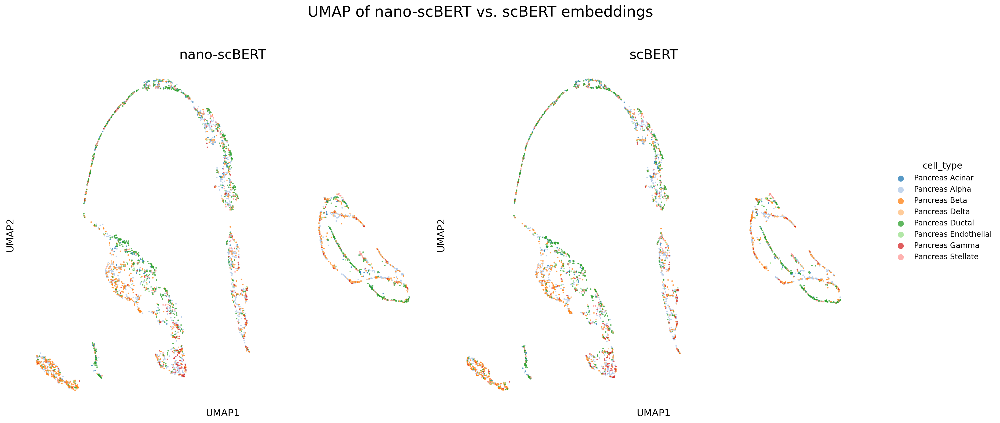
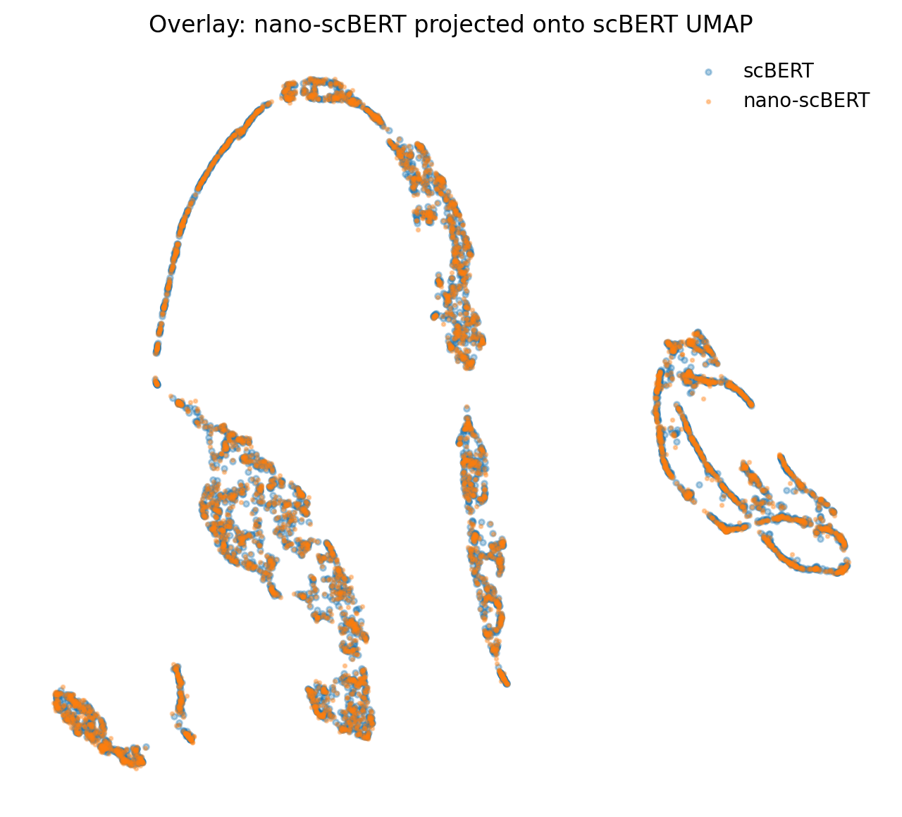

# nano-scBERT

A minimal, fast, and faithful reimplementation of [scBERT](https://github.com/TencentAILabHealthcare/scBERT) for single-cell foundation model inference, with planned support for fine-tuning and training from scratch.

nano-scBERT is designed to make scBERT easier to understand, modify, and run while preserving the behavior of the original model.



nano-scBERT aims to provide:
- A clean and minimal implementation
- Faithful reproduction of the original scBERT architecture
- Faster inference with modern PyTorch optimizations
- A codebase suitable for experimentation, fine-tuning, and future training from scratch

## The nano-scFMs Project
Single-cell foundation models (scFMs) are one of the most promising directions in AI for biology, yet many existing repositories remain difficult to read, extend, benchmark, or use as educational resources.

nano-scBERT is part of **nano-scFMs**, a collection of lightweight reimplementations of popular single-cell foundation models. The goal is to make state-of-the-art scFMs easier to understand, extend, benchmark, and use as educational resources.

All repositories are implemented in pure, modern PyTorch and follow a consistent coding style, making it straightforward to install, compare, and experiment with different models using the same environment and shared [requirements file](https://github.com/huynguyen250896/nano-scBERT/blob/main/requirements.txt). 

Available Models:

- [X] nano-scBERT
- [X] [nano-Geneformer](https://github.com/huynguyen250896/nano-Geneformer)
- [ ] nano-scFoundation
- [ ] nano-CellFM
- [ ] nano-UCE
- [ ] nano-scPRINT

**NOTE:** Danqi Liao has already created an excellent minimal implementation of scGPT, so I chose not to duplicate that effort. If you're looking for a lightweight version of scGPT, check out [nano-scGPT](https://github.com/Danqi7/nano-scGPT).

If you know of another single-cell foundation model that should be included, feel free to open an issue or send me a message. To keep the collection focused on established methods, I currently only plan to include models that have been published in peer-reviewed journals.

## Benchmark 
I carefully benchmarked nano-scBERT across different settings to give future users confidence in adopting nano-scBERT as a drop-in alternative to the official implementation. Full benchmark details are available in [benchmark_scbert_vs_nano.ipynb](benchmark_scbert_vs_nano.ipynb).

#### Inference Runtime
nano-scBERT achieves approximately **2.5× faster inference** while reducing **peak GPU memory by 7.5%** compared to the original scBERT implementation.

| Model           | Total (4,146 cells) |      Per cell |        Throughput |      Peak GPU | % Reduced Peak GPU |   Speedup |
| --------------- | ------------------: | ------------: | ----------------: | ------------: | -----------------: | --------: |
| **nano-scBERT** |         **73.07 s** | **16.838 ms** | **59.39 cells/s** | **18.255 GB** |           **7.5%** | **2.46×** |
| scBERT          |            173.17 s |     41.480 ms |     24.11 cells/s |     19.726 GB |                  — |     1.00× |


#### Cell-level Embedding Reproducibility
nano-scBERT reproduces the original scBERT embedding space almost exactly, preserving both local and global structure.



| Metric                    |         Value |
| ------------------------- | ------------: |
| Mean cosine similarity    |    **1.0000** |
| Median cosine similarity  |    **1.0000** |
| Minimum cosine similarity | **0.9999998** |
| Mean absolute difference  |  **2.68e-06** |
| Distance correlation      | **0.9999999** |


The PCA spectrum and pairwise distance structure are nearly identical between nano-scBERT and the original implementation.

> Benchmarked on a single NVIDIA A100 (80 GB) GPU with batch size 32 on the Pancreas dataset (4,146 cells).

## Install
```bash
git clone https://github.com/huynguyen250896/nano-scBERT.git
cd nano-scBERT

pip install -r requirements.txt
```

## Quick Start

### Using nano-scBERT in Python
#### Generate Cell Embeddings from Raw-count `.h5ad`
```python
import torch
import scanpy as sc

from scBERT_tokenizer import scBERTTokenizer, get_pretrained
from preprocessing import preprocess_adata
from model import PerformerLM

# Select GPU if available; otherwise fall back to CPU.
device = torch.device("cuda" if torch.cuda.is_available() else "cpu")

# Choose the supported pretrained nano-scBERT checkpoint.
# Available options:
#   - scbert-human-panglao
model_name = "scbert-human-panglao"
model = PerformerLM.from_pretrained_name(model_name).to(device) # Load the pretrained model.
model.eval() # Switch to inference mode (disable dropout).

# Optional: compile the model for faster inference and lower peak GPU memory.
if device.type == "cuda":
    model = torch.compile(model)

# Load raw-count .h5ad.
adata = sc.read_h5ad("./pancreas.h5ad")

# Preprocess and tokenize the input cells.
tokenizer = scBERTTokenizer.from_pretrained(model_name)

adata = preprocess_adata(
    adata,
    tokenizer.genes,
)

tokens = tokenizer.encode_adata(adata)
x = torch.from_numpy(tokens).long()

# Run nano-scBERT.
# Returns a tensor of shape (n_cells, hidden_size).
embs = model.encode(
    x,
    batch_size=64,  # Increase if GPU memory allows.
)
```

### Using nano-scBERT from the Terminal
#### Generate Cell Embeddings from Raw-count `.h5ad`
```sh
python tasks/embedding.py \
    --input data/pancreas.h5ad \
    --output outputs/nano_scbert_embeddings.npy \
    --model scbert-human-panglao \
    --batch_size 32 \
    --mode raw
```

#### Generate Cell Embeddings from scBERT-styled preprocessed `.h5ad`
```sh
python tasks/embedding.py \
    --input data/pancreas_scbert_preprocessed.h5ad \
    --output outputs/nano_scbert_embeddings.npy \
    --model scbert-human-panglao \
    --batch_size 32 \
    --mode preprocessed
```

## Roadmap
- [X] Embedding .h5ad scRNA data
- [ ] Finetuning for cell type classification
- [ ] Finetuning for novel cell type detection
- [ ] Training from scratch

Let me know what tasks you'd like to see next!

## Acknowledgments
1. If you find this repo interesting and/or use nano-scBERT in your work, please cite the original paper:
>Yang, F., Wang, W., Wang, F. et al. scBERT as a large-scale pretrained deep language model for cell type annotation of single-cell RNA-seq data. Nat Mach Intell (2022). https://doi.org/10.1038/s42256-022-00534-z

and STAR⭐ my repo. Thanks!

2. nano-scBERT is inspired by Andrej Karpathy's [nanoGPT](https://github.com/karpathy/nanogpt), Chris Hayduk's [minAlphaFold2](https://github.com/ChrisHayduk/minAlphaFold2), and especially Danqi Liao's [nano-scGPT](https://github.com/Danqi7/nano-scGPT).

## License
[MIT LICENSE](LICENSE)
